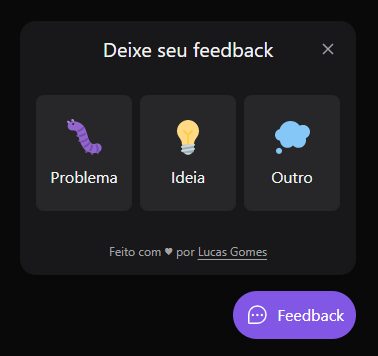

<div align="center" id="top"> 
  

  &#xa0;

  <a href="https://widget-feedback-web-nu.vercel.app/">Widget demo</a>
</div>

<h1 align="center">Widget Feedback</h1>

<p align="center">
  

  

  

  

  <!--  -->

  <!--  -->

  <!--  -->
</p>

<!-- Status -->

<!-- <h4 align="center"> 
	🚧  Web 🚀 Under construction...  🚧
</h4> 

<hr> -->

<p align="center">
  <a href="#dart-about">About</a> &#xa0; | &#xa0; 
  <a href="#sparkles-features">Features</a> &#xa0; | &#xa0;
  <a href="#rocket-technologies">Technologies</a> &#xa0; | &#xa0;
  <a href="#white_check_mark-requirements">Requirements</a> &#xa0; | &#xa0;
  <a href="#checkered_flag-starting">Starting</a> &#xa0; | &#xa0;
  <a href="#memo-license">License</a> &#xa0; | &#xa0;
  <a href="https://github.com/{{YOUR_GITHUB_USERNAME}}" target="_blank">Author</a>
</p>

<br>

## :dart: About ##

Projeto realizado com intuito de criar (Front(react) | Back(nest)) um widget de feedback.

## :sparkles: Features ##

:heavy_check_mark: Feature 1;\
:heavy_check_mark: Feature 2;\
:heavy_check_mark: Feature 3;

## :rocket: Technologies ##

The following tools were used in this project:

- [Node.js](https://nodejs.org/en/)
- [React](https://pt-br.reactjs.org/)
- [TypeScript](https://www.typescriptlang.org/)
- [headlessui](https://headlessui.dev/)
- [html2canvas](https://github.com/niklasvh/html2canvas)
- [Tailwindcss](https://tailwindcss.com/)
- [Axios](https://axios-http.com/ptbr/docs/intro)
- [NestJS](https://nestjs.com/)
- [JestJS](https://jestjs.io/pt-BR/)
- [ExpressJS](https://expressjs.com/pt-br/)
- [prisma](https://www.prisma.io/)
- [nodemailer](https://nodemailer.com/about/)

## :white_check_mark: Requirements ##

Before starting :checkered_flag:, you need to have [Git](https://git-scm.com) and [Node](https://nodejs.org/en/) installed.

## :checkered_flag: Starting ##

```bash
# Clone this project
$ git clone https://github.com/{{YOUR_GITHUB_USERNAME}}/nlw-return-impulse

# Access
$ cd web

# Install dependencies
$ npm i

# Run the project
$ npm run dev

# The project will initialize in the <http://localhost:3000>

# Access in nlw-return-impulse
$ cd server

# Install dependencies
$ npm i

# Run the project
$ npm run dev

# The server will initialize in the <http://localhost:3333>
```

## :memo: License ##

This project is under license from MIT. For more details, see the [LICENSE](LICENSE.md) file.


Made with :heart: by <a href="https://github.com/{{YOUR_GITHUB_USERNAME}}" target="_blank">{{YOUR_NAME}}</a>

&#xa0;

<a href="#top">Back to top</a>
